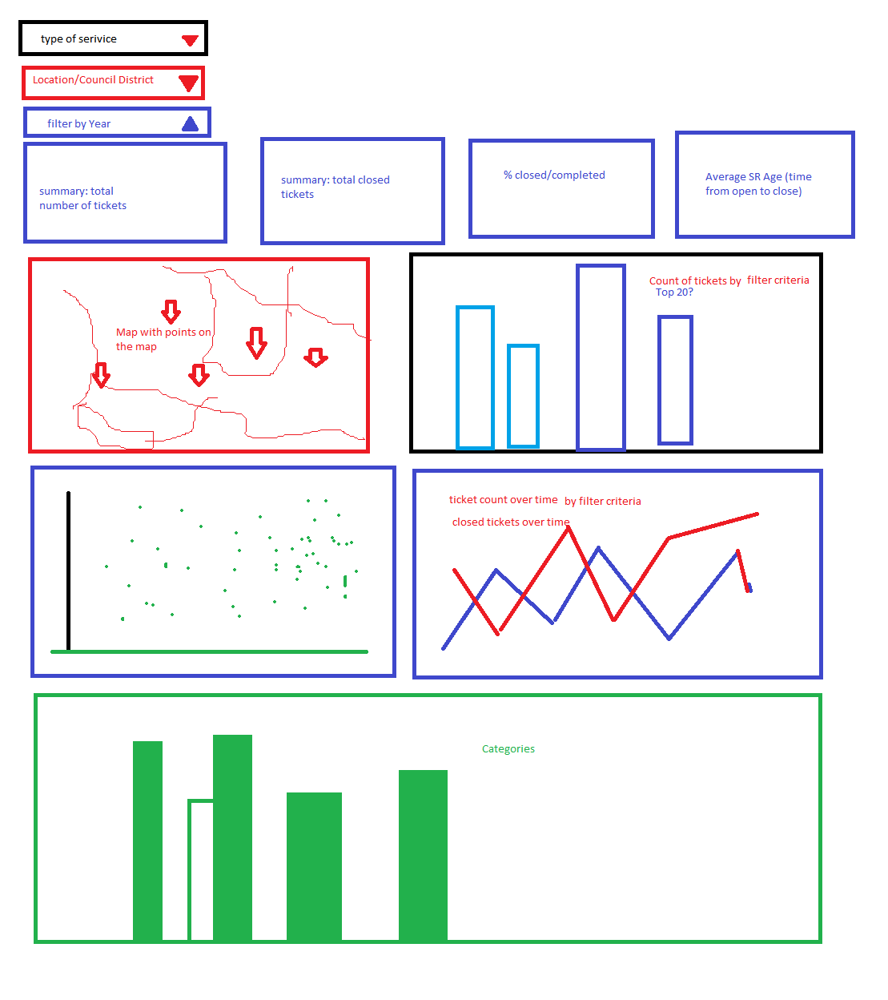
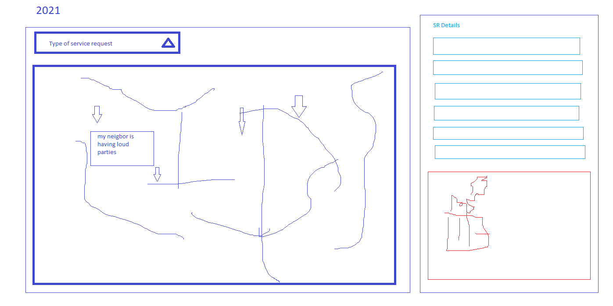

# City of San Diego Get it Done Dashboard Project
## Team git-it-on

## INSTRUCTIONS FOR RUNNING THE APP
The following instructions for running the app are provided in the order in which they should be done:
1) Under pages/static/js, create a config.js file that contains this line:
const API_KEY = "<YOUR MAPBOX API KEY HERE!>";

2) Under src, modify the config_sample.py file by renaming it to config.py and after mongo_conn=, pasting the link that we have provided to you in the comments with the submission
3) From VScode, open pages/index.html with live server
4) Run app.py

## Project Description

### Intended Audience:
City of San Diego Leadership

### Decision: 
Strategic/Operational – identify problem-areas, monitor and gage effectiveness of the Get-It-Done program overall and by Council district, using:
•	Service request volume by period, type, council district
•	Average response time from open to closed
•	Open/closed deltas
•	Service request volumes by type by council district

### Decision timing:  
Ongoing for the life of the app

### Importance: 

The dashboard can assist City Leadership in quickly identifying problem areas or problem periods, such as holidays, tourist season, etc.

### What actions can be taken: 
The dashboard is a monitoring tool for City Leadership allowing for further investigation, remedying or use a pro-active approach as appropriate for the issue.  For instance, during tourist season or while large conventions are in town, it is possible that mobile service requests for scooters spike.  If the City had historical data to confirm this assumption, the City could take a pro-active approach and request that the scooter service vendors increase their collection efforts during those times, thereby reducing the number of service requests, the amount of resources the City would otherwise have to dedicate, and last but not least: reduce the nuisance factor for the public.

### What are we trying to show with the data

- Service request counts - Most volume category Get-It-Done requests
- Status (over time)
- Categories - type of service request over time and by location / council district
- Show volume of service requests over time
- Summary of open/closed service requests in date range
- Length in days to close a service request on average per category
- Drop down selector to filter data more granularly 
- Toggle heat map (layer) and markers layer (lat, lon) of get it done requests
- response time, open/close delta
- Map selector to populate data charts

## Conclusions

### Number of Service Requests By Year

In 2019, service requests peeked in July and August.  District data should be verified to see if spikes could possibly occur in more popular tourist areas.

In 2020, service requests dipped significantly in April which correlates with the start of COVID-19 restrictions, and peeked in October.

### Service types

Since 2019, illegal dumping has been the most popular service request in the City of San Diego. Further analysis is required to see if locations of the occurrences are repetitive or clustered.

Missed collections is experiencing a significant increase since 2019 and is still trending upwards. Council district data should be reviewed to determine if this is a city-wide trend or if this is occurring in specific areas. Causes could be things such as an aging vehicle fleet or area population growth. Possible remedies could be additional training if the issue is area-specific, additional resources if the issue is city-wide.

### Council Districts Perforamance

The data shows that the Council District with the fewest service requests has the longest average case length.  Further review disclosed that District 5 has several long-duration service request types that possibly skew the average case length:
•	Evaluate for resurfacing: 280 cases at 400 days to close
•	Sidewalk repair issues: 750 cases at 200 days to close

It is recommended to remove the above two items from the data and reevaluate the average case length of District 5.  If the data still shows a significant higher average case length, possible culprits such as high volume service requests should be reviewed to determine if there are training or resource issues. 

## Dashboard Development

