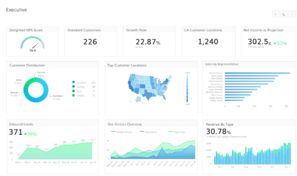
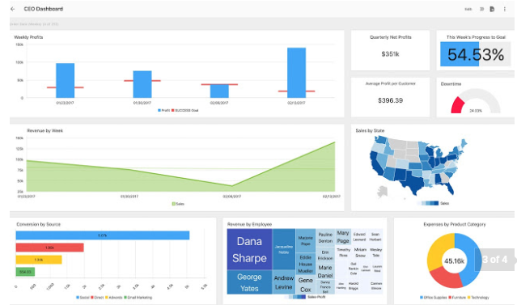
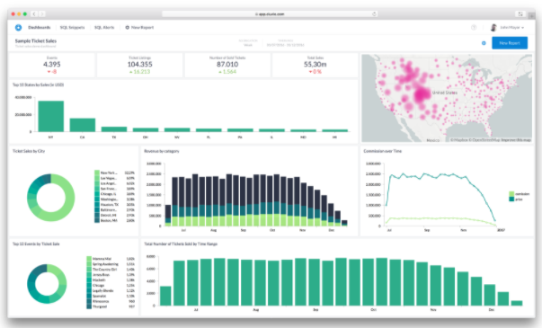

# City of San Diego Get it Done Dashboard Project
## Team git-it-on

## Project Proposal

### Who is our audience
City of San Diego Leadership

### Why?
Show Get It Done (GID) app, effectiveness and performance based on location, reveal areas where resources could be allocated or reallocated based on need or volume of cases.

### What are we trying to show with the data

- Ticket count - Most volume category GID tickets
- Status (over time)
- Categories - type of ticket over time and by location / council district
- Show volume of tickets over time
- Summary of open/closed tickets in date range
- Length in days to close a ticket on average per category
- Drop down selector to filter data more granularly 
- Toggle heat map (layer) and markers layer (lat, lon) of get it done requests
- response time, open/close delta
- Map selector to populate data charts

## Questions we may be able to answer:

- Volume of tickets by category by year / quarter / area
    - Is volume of tickets evenly distributed by council district?
    - Do certain areas have a noticeably smaller or larger number of tickets in any category?
    - Is the volume of tickets steady or are there dips/spikes?
    - Are dips/spikes occurring during certain times of the year? Certain areas?
    
- Performance indicators
    - Average number of days from open to close by category, council district vs overall
    - Is average time to resolve a ticket same across categories? Across council districts?
    - Are there dips/spikes?  Certain areas?  Certain times of year?

- Identify outliers - high/low number of ticket in any category 
- Lead to action: what action? -> goal reduce number of tickets by 10% in specific category in specific location

This information may help leadership determine if certain areas lack resources, if resources are sufficient but unable to keep up for other reasons, if resources can be moved (temporarily) to other areas to assist, or if more resources need to be allocated, possibly to certain areas during certain times of the year.  

Additional analysis beyond the scope of this dashboard may have to be performed to determine cause and effect of performance issues.

## Example Dashboards

