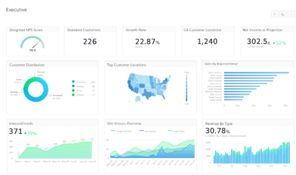
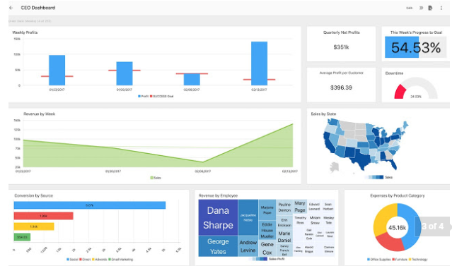
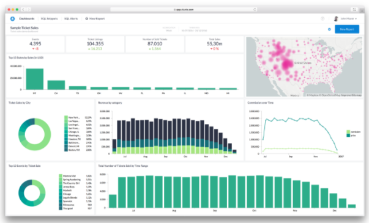

# City of San Diego Get it Done Dashboard Project
## Team git-it-on

## Project Proposal

### Who is our audience
City of San Diego Leadership

### Why?
Show get it done app, effectiveness or ineffectiveness, based on location, reveal areas where resources could be allocated or reallocated based on need/vol of cases

### What are we trying to show with the data

- Ticket count - Most volume category GID tickets
- Location (lat lon - leaflet map)
- Toggle heat map (layer) and markers layer (lat, lon) of get it done requests
- response time, open/close delta
- Status (overtime)
- Categories - type of ticket overtime and location
- overtime volume of tickets, line charts overtime, summary of - open tickets, closed tickets in date range
- How long to close a ticket on average per category
- Map selector to populate data charts
- Drop down selector to filter data more granularly 
- Bonus: pull in census data to show demographics, etc for different area codes

## Questions we may be able to answer:

- Volume of tickets by category by year / quarter / area
    - Is volume of tickets evenly distributed by area?
    - Do certain areas have a noticeably smaller or larger number of tickets in any category?
    - Is the volume of tickets steady or are there dips/spikes?
    - Are spikes occurring during certain times of the year? Certain areas?
    - Check for excessive duplicate entries

- Performance
    - Average days from open to close
    - Is average time to resolve a ticket same across categories? Across council districts?
    - Are there spikes/dips?  Certain areas?  Certain times of year?
    - Check for excessive duplicate entries

- Identify outliers - high/low number of ticket in any category 
- Lead to action: what action? -> goal reduce number of tickets by 10% in specific category in specific location

This information may help management determine if certain areas don’t have enough staff, if staff cannot keep up consistently, if staff can be moved (temporarily) to other areas to assist, or if more funds need to be allocated, possibly to certain areas during certain times of the year.  

## Example Dashboards

